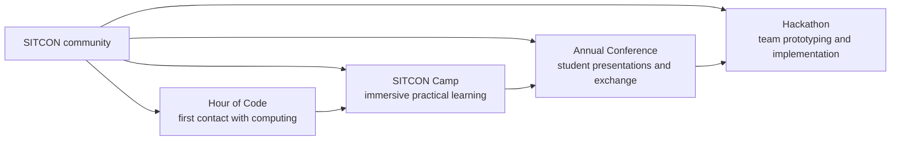
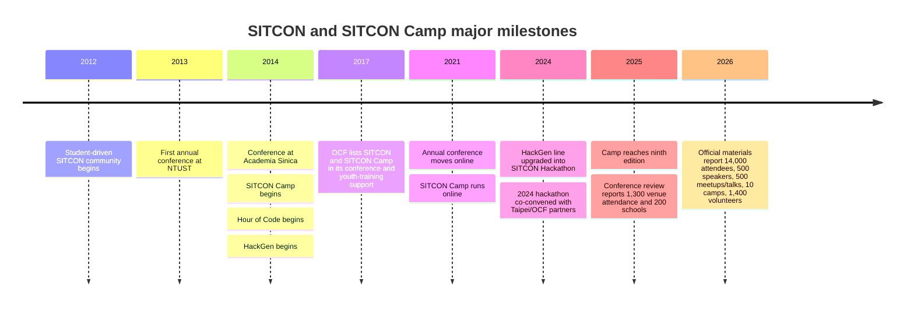

# SITCON and SITCON Camp

## Executive Summary

SITCON stands for **Students’ Information Technology Conference**. In the official materials and archives, it appears less as a single yearly conference than as a **student-built learning ecosystem**: it was initiated in 2012, held its first annual conference on March 16, 2013 at National Taiwan University of Science and Technology, and by 2014 had already expanded into adjacent programs including **SITCON Camp**, **Hour of Code**, and **HackGen**. The common thread across those activities is consistent: a student-centered stage for sharing technical knowledge, wider access to computing education, and the cultivation of open-source values through participation rather than passive consumption. citeturn2search7turn8view1turn6view4turn23view0

Analytically, the best way to understand SITCON is as a **pipeline**. Official 2026 materials frame the community around four activity types: Hour of Code as a beginner entry point, Camp as immersive hands-on learning, the annual conference as the main public stage, and the hackathon as a place to turn ideas into prototypes. Within that system, **SITCON Camp is not a separate organization** but a deliberately earlier-stage, more guided learning format aimed at younger students, especially high-school participants. By 2026, SITCON’s own materials reported cumulative scale on the order of **14,000 conference attendees, 500 student speakers, 500 meetups and talks, 10 camps, and 1,400 volunteers**. citeturn23view0turn5view5turn6view2turn27search13

SITCON has also evolved organizationally. It remains visibly **student-led and volunteer-run**, but it now sits inside a broader support structure that includes publicly visible GitHub infrastructure, open mailing-list and meeting-note practices, and longstanding partnership/support relationships with the Open Culture Foundation and, in some projects, public-sector institutions. Its official materials also claim regional influence, notably inspiring **SITCON x HK** in Hong Kong and a student open-source conference in Chongqing. Read broadly, SITCON’s evolution is from **one conference into a durable student technology community with multiple entry points and recurring intergenerational renewal**. citeturn5view4turn10view0turn28view1turn26search3turn26search7

## Scope and Source Basis

This report follows the requested source order. Research began with the official **SITCON Camp** site, then the official **SITCON** site and yearly archives, then the verified **sitcon-tw GitHub organization**. After those primary sources, it was cross-checked against additional English-language materials from the **Open Culture Foundation**, **Taipei City Government**, the **National Science and Technology Council**, and selected English-language community biographies where those biographies supplied first-person role claims that matched SITCON’s archival record. The primary-source backbone, therefore, is official and organizational first; external sources are used mainly for corroboration, institutional context, and named-person attribution. citeturn23view0turn5view5turn5view4turn28view2turn14view0turn14view1turn16view0turn17view0

A methodological caveat matters. Official SITCON sources are strong on **mission, current structure, activity summaries, and high-level historical markers** such as “since 2012” or “since 2014,” but less strong on **one canonical, fully consolidated year-by-year institutional history** with complete attendance figures for every edition. Where precise early roles or founder attributions are included below, they are either taken from official archival pages or from self-maintained English biographies/GitHub profiles and flagged as such. citeturn23view0turn5view5turn16view0turn17view0

## Background and Origin

SITCON’s own branding guide defines the name as **Students’ Information Technology Conference**, and current official pages describe it as a **student-driven community dedicated to IT education and the open-source spirit**, as well as a **student-organized conference** that gives students a platform to present and exchange technical knowledge. The same language appears across recent conference and camp materials, which suggests that the organization’s identity has remained unusually stable even as the scope of activity has grown. citeturn2search7turn5view5turn6view6

The available official chronology begins clearly in **2012**, which current SITCON materials mark as the start of the student-initiated community. The first annual conference then took place on **March 16, 2013**, at **National Taiwan University of Science and Technology**, with organizing support from the SITCON team and educational/open-source partners. By the second annual conference, held on **March 15, 2014** at **Academia Sinica’s Humanities and Social Sciences Building**, the event had already gained a larger institutional setting and a more mature partner structure. The current SITCON home page also links yearly archives continuously from **2013 through 2026**, underscoring long-run continuity rather than one-off event status. citeturn23view0turn8view1turn8view4turn25view0

The more important historical point is that SITCON did not remain only an annual conference for long. Official 2026 pages state that **Hour of Code** began in collaboration with Taiwan’s Ministry of Education in **2014**; **HackGen** was held in **2014 and 2015** before later being reworked into the modern SITCON Hackathon; and **SITCON Camp** also began in **2014** as a July summer program for students curious about computing and open source. In other words, SITCON’s “origin story” is not just a conference success story. It is a story of students building a **layered community architecture** around learning, sharing, and open collaboration. citeturn6view4turn6view0turn23view0

## Mission and Organization

SITCON’s mission is expressed with striking consistency across recent official pages. The recurring themes are that students need a stage, computing education should be widened, and open source should be learned not only as software licensing but as a culture of **sharing, collaboration, and giving back**. The official English “About SITCON” page says the community is dedicated to IT education and promoting the open-source spirit; the camp materials translate that into a developmental model in which newcomers first discover computing, then build practical ability, then join a broader student community, and finally turn ideas into real projects. That is why SITCON is better read as a **mission-driven educational commons** than as a conference brand alone. citeturn5view5turn6view2turn23view0

Its organizational design reflects that mission. The annual conference uses a large volunteer structure with functionally specialized teams such as **general coordination, administration, program/agenda, venue operations, design, finance, documentation, broadcasting/production, development, editorial, and marketing**. The 2026 camp uses a parallel but camp-specific structure including **general coordination, administration, finance, curriculum and activities, logistics, documentation, mentor/cabin teams, editorial, marketing, and development**. That continuity of structure across formats suggests that SITCON has developed a reusable operating model for student-led events rather than improvising each edition from scratch. citeturn20view0turn23view0turn23view1turn23view2

SITCON also appears unusually open in how it organizes itself. Official pages invite people into a public **mailing list**, public **Telegram** spaces, and in some years public **HackMD meeting records**. On GitHub, the verified **sitcon-tw** organization controlled the **sitcon.org** domain as of June 2026 and exposed around **120 public repositories**, including yearly conference sites, camp sites, tooling for submission review, a public credits index for past staff and speakers, and other event infrastructure. That combination of public discussion and public code is strong evidence that “open source spirit” is operationalized in SITCON’s process, not only invoked rhetorically. citeturn10view0turn6view5turn5view4

A final organizational layer is institutional support. OCF’s English annual reports repeatedly describe its role as a **fiscal sponsor** and administrative supporter for community-led projects, including **Students’ Information Technology Conference**, precisely because many community organizers are students or otherwise lack a legal entity for contracts, accounting, and personnel administration. This does not negate SITCON’s student leadership; it explains how a student-led community could persist long enough to become stable. In practice, SITCON seems to be **student-run at the program layer, but scaffolded by support organizations at the legal and administrative layer**. citeturn28view1turn28view2turn14view2

The official 2026 pages effectively describe SITCON’s activity architecture as a staged learning path. citeturn23view0

## Activities and SITCON Camp

The annual **SITCON conference** is the community’s flagship public stage. Official descriptions portray it as a student-organized conference centered on student speakers and student issues, while actual program pages show a mix of **keynotes, talk sessions, forums, and multiple rooms/tracks**. CFP pages for recent editions also show a broader menu of formats, including general sessions, open sessions, and posters, while sponsor and about pages frame the event as a bridge between students, ideas, and future tech talent. Even in the conference format, then, SITCON is not just “talks”; it is a structured space for technical presentation, peer recognition, and community formation. citeturn7view0turn19search3turn19search5turn6view2

**SITCON Camp** uses the same value system but a different pedagogy. Official pages describe it as a **five-day, four-night immersive camp** designed to convert interest into hands-on ability and to help participants meet peers. The clearest English overview currently accessible is the 2025 camp site, which says the camp has been running **since 2014**, had reached its **ninth edition** by 2025, and has covered a wide range of topics including **open source, cybersecurity, maker projects, Python, Node.js, front-end web scraping, data visualization, and Telegram bots**. It also emphasizes non-lecture formats such as **community challenges, Vision Café, and hackathons**. The current 2026 official camp home page further narrows the audience: it describes the camp as a **high-school-oriented** program held at **National Yang Ming Chiao Tung University** and framed around **software engineering, AI, and cybersecurity**. citeturn6view0turn23view0turn27search13

The organizational texture of camp is also more pastoral and guided than the annual conference. The 2026 camp team includes not just coordination, finance, and development functions, but also a **mentor/cabin-leader team** responsible for accompanying participants throughout the camp. That is a useful clue to what SITCON Camp is for: not merely knowledge transfer, but **social onboarding into a community and culture**. citeturn23view1turn23view2

The short comparison below captures the broad distinction.

| Dimension | SITCON | SITCON Camp | Basis |
|---|---|---|---|
| Purpose | Student-run annual conference that gives students a stage to present and exchange technical knowledge. | Immersive summer camp meant to turn curiosity into practical ability and introduce students to open-source/community culture through hands-on work. | citeturn5view5turn7view0turn23view0 |
| Audience | Broad student tech community; recent official statistics show many attendees are from universities or graduate schools, while the organization as a whole also serves younger learners through other programs. | Explicitly designed for high-school students in current official materials. | citeturn6view2turn23view0turn27search13 |
| Frequency | Annual conference, with official archives linked from 2013 through 2026. | Annual summer-camp series beginning in 2014; 2025 called itself the ninth edition, and 2026 materials count 10 camps in total. | citeturn25view0turn6view0turn5view5 |
| Format | Conference-style program with keynotes, talks, forums, multi-room sessions, and other presentation formats. | Five-day, four-night immersive camp with main courses, community challenges, Vision Café, and hackathon-style activities. | citeturn19search3turn19search5turn6view0turn23view0 |

## Milestones and Timeline

The clearest way to see SITCON’s evolution is to track the moments when it changed form: first from community idea to conference, then from conference to ecosystem, then from ecosystem to durable civic/open-source institution. The table below prioritizes milestones that are directly visible in official or primary organizational sources. citeturn8view1turn6view4turn28view2turn10view0turn14view0

| Year | Major milestone | Why it matters | Basis |
|---|---|---|---|
| 2012 | SITCON is initiated as a student-driven community. | Establishes the origin point before the first public conference. | citeturn23view0turn19search1 |
| 2013 | First annual conference held on March 16 at National Taiwan University of Science and Technology. | Marks SITCON’s first public flagship event. | citeturn8view1 |
| 2014 | Second conference held at Academia Sinica; SITCON Camp begins; Hour of Code begins; HackGen begins. | This is the decisive expansion from one conference into multiple learning formats. | citeturn8view4turn6view4turn6view0 |
| 2017 | OCF’s English annual report lists SITCON as a supported large-scale conference and SITCON Camp as a youth-training program. | Shows that SITCON had become a recurring, institutionally supported part of Taiwan’s open-source ecosystem. | citeturn28view2 |
| 2021 | Annual conference moves online; camp also runs online. | Demonstrates pandemic adaptation without activity collapse. | citeturn10view0turn22search0 |
| 2024 | Earlier HackGen line is formally described as upgraded into **SITCON Hackathon**; Taipei City Government says the 2024 SITCON Hackathon was co-convened with government and OCF partners. | Marks a mature form of project-based, cross-sector activity beyond the conference itself. | citeturn6view4turn14view0 |
| 2025 | Camp describes itself as the ninth edition; official conference review reports 1,300 venue attendance and participants from 200 schools. | Indicates both continuity and substantial contemporary scale. | citeturn6view0turn6view2 |
| 2026 | Official materials report 14,000 conference attendees, 500 student speakers, 500 meetups/talks, 10 camps, and 1,400 volunteers. | Gives the clearest current aggregate snapshot of community reach. | citeturn5view5turn6view2 |

The following chart is a visual condensation of the same milestone series. citeturn23view0turn8view1turn8view4turn28view2turn10view0turn22search0turn14view0turn6view2

## Community Impact and Notable People

The official case for SITCON’s impact has three layers. First is **scale**: recent official materials describe it as the largest student IT community in East Asia and report cumulative counts of thousands of attendees, hundreds of student speakers, hundreds of meetups/talks, and a large volunteer base. Second is **renewal**: the same official English materials say that more than half of participants each year are first-timers, while alumni later work across Taiwan, the United States, Japan, and the Netherlands and often return to support the community. Third is **diffusion**: SITCON says it inspired **SITCON x HK** and the **Student Open Source Conference in Chongqing**, and the Hong Kong site independently describes SITCON x HK as a student-centered event organized by Hong Kong students. Taken together, those points suggest that SITCON’s real impact is not just attendance but **community reproduction**: it repeatedly turns newcomers into organizers, speakers, alumni, and local imitators. citeturn5view5turn26search3turn26search7

Impact also appears in the breadth of activity beyond the annual conference. Official pages say Hour of Code has, since 2014, sparked curiosity about computing among **hundreds of children and students aged 4 to 16**. The camp format creates a lower-barrier, more intensive route into computing culture for high-school students. OCF’s English reports place SITCON inside Taiwan’s wider open-source event network, including the **OSCVPass** collaboration with COSCUP, MOPCON, g0v Summit, and PyCon Taiwan. Meanwhile, Taipei City Government’s English news noted SITCON as a co-convener of the **2024 SITCON Hackathon**, linking the community not just to student learning but to open-data, civic, and public-interest experimentation. citeturn6view4turn27search13turn28view1turn14view2turn14view0

A few people stand out as especially notable in the accessible record. **Denny Huang** identifies himself on GitHub as a **SITCON co-founder and chief coordinator for 2013 and 2014**. **Poren Chiang** identifies himself in his English CV as a **co-founder**, later **summer-camp vice organizer**, and later **chief organizer** of SITCON; his CV also records an English talk in Hong Kong titled **“From 1 to 2300: A brief history of SITCON and how it was organized,”** which is useful evidence that SITCON was already being represented externally as a transferable model by 2015. And on the program side, the first 2013 conference featured **Jim Huang (jserv)**, a prominent Taiwanese open-source developer and educator, as an early keynote-level speaker, showing SITCON’s early linkage to Taiwan’s broader FLOSS scene. These examples are illustrative rather than exhaustive, but they show the blend of **student organizers, returning community builders, and senior open-source figures** that helped shape SITCON’s trajectory. citeturn16view0turn17view0turn26search11turn8view1

## Gaps and Uncertainties

A few uncertainties remain in the accessible record. The official pages clearly establish that SITCON dates to **2012** and that SITCON Camp dates to **2014**, but they do not provide one single, consolidated official chronology with exact dates and attendance counts for every edition. The camp series is also slightly more opaque around the pandemic years: the official sources clearly show an **online 2021 camp**, while the current official summaries say the camp started in 2014, 2025 was the **ninth edition**, and the 2026 materials count **10 camps** in total; those statements are broadly consistent, but the currently accessible official pages do not spell out each intervening year in one place. Finally, the clearest English-language camp overview I found is the **2025 English page**, whereas the most current 2026 camp organizational detail is more accessible on the Chinese official pages. For named founders and long-term organizers, I therefore relied on a combination of official SITCON archives and self-maintained English bios/GitHub profiles, and I have limited those usages to role claims that align with the archival record rather than treating them as independent historical proof of everything else. citeturn6view0turn23view0turn5view5turn22search0turn16view0turn17view0