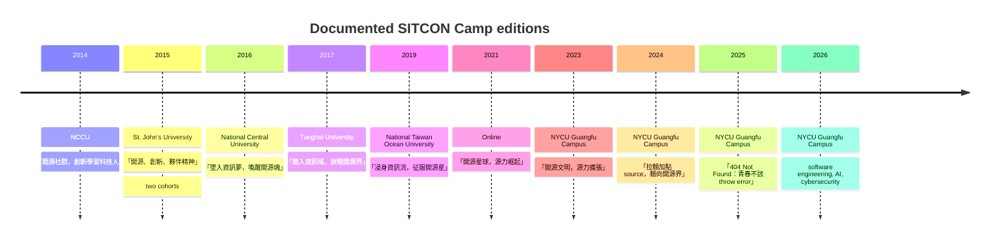

# SITCON Camp Analytical Report

## Executive summary

SITCON Camp is the summer-camp arm of Taiwan’s broader SITCON student technology community. Across public materials from 2014 to 2026, its recurring mission is to lower the entry barrier to computing, “root” information education earlier in students’ learning journeys, and connect technical practice with open-source culture, peer exchange, and community participation. SITCON’s own 2026 materials place Camp alongside the annual conference, Hour of Code, and Hackathon as one of four major activity lines, and describe the whole community as student-driven, open-source-oriented, and built around learning through doing and sharing. citeturn3view1turn3view2turn21view0turn28search11

In practice, SITCON Camp has been an immersive summer program rather than a single fixed format. Earlier documented editions were usually four days and three nights; more recent in-person editions are typically five days and four nights; the pandemic-era 2021 edition was a seven-day online camp. The program model is highly consistent even as topics evolve: a core technical track, breadth sessions introducing adjacent fields, project work or hackathon-style collaboration, open-source/community culture sessions, and structured social activities such as community challenges, expos, and close-range dialogue sessions like “Vision Café.” citeturn14view3turn24view0turn26view0turn30search0turn17view0turn10view1turn19view4turn4view0

The target audience has narrowed somewhat over time. Older brochures explicitly recruited students from junior high school upward, while current positioning describes the camp as designed for high-school students and requires student-status verification. Public-facing materials are strong on mission, dates, venues, fees, and program design, but much weaker on exact participant demographics and final attendance. For that reason, the most defensible cross-year size comparison is usually official intake or capacity, which in most recent editions clusters around roughly 54 to 60 learners. citeturn24view0turn26view0turn17view0turn7search3turn34search1turn18view4turn13view1turn19view4turn6view1

Analytically, the camp’s long-run pattern is clear. It began as a broad “open source plus student tech culture” residential camp on university campuses, then developed a strongly story-driven, community-rich format centered on Python, bots, hackathons, and open-source participation, and more recently has shifted toward explicit pathway-finding in AI, cybersecurity, software engineering, and project building. What has stayed stable is the pedagogical philosophy: learn by making, learn in teams, and learn within a student community rather than only from lectures. citeturn14view3turn24view1turn24view2turn30search0turn17view0turn10view1turn8view0turn4view0

## What SITCON Camp is

Official SITCON descriptions frame Camp as a student-built entry point into information technology and open-source culture. The 2026 Camp site says SITCON was started by students, brings information education, technical exchange, and open-source collaboration to different learning stages, and uses Camp specifically to convert curiosity about computing into practical ability over an immersive multi-day format. The 2025 organizing-team page describes the camp as a way to “root” information education downward and help interested students absorb knowledge, practice hands-on work, and discover their interests through core classes, community challenges, Vision Café, and hackathons. citeturn3view1turn21view0

That framing has been stable since the earliest camp years. The inaugural 2014 site described the summer camp as a way to lead students beyond textbook-only understandings of the information world, cultivate independent thinking and collaboration, and help participants realize their own value through open-source participation. The 2015 and 2016 registration brochures also define the camp as an “entry guide” into the information field, emphasizing achievement through lively coursework, problem solving through teamwork, and familiarity with open-source communities rather than narrow exam-oriented learning. citeturn14view3turn24view0turn24view2

Within the broader SITCON ecosystem, Camp appears to fill the “immersion and practice” role between short-form outreach and the large annual conference. SITCON’s 2026 “about” materials explicitly list four activity lines—Hour of Code, Camp, the annual conference, and Hackathon—and describe Camp as the stage where students spend “five days and four nights” converting curiosity into practical ability while meeting like-minded peers. citeturn3view1

## How the camp is usually structured

The most stable structural pattern is a blend of core instruction, breadth sessions, collaborative project work, and community-oriented activities. Recent official pages repeatedly describe three recurring program blocks: a main curriculum, breadth courses that broaden students’ view of the field, and interaction-heavy sessions such as hackathons, community challenges, and Vision Café. The 2025 English page is especially explicit: breadth courses are intended to prevent a single teaching approach from narrowing students’ horizons, while the Vision Café format is designed to let participants speak closely with senior figures from different fields and communities. citeturn8view0turn8view1

The 2026 schedule is a particularly clear modern example. It opens with onboarding and a “lead-in” course, then dedicates separate days to software engineering, artificial intelligence, and cybersecurity, with each theme paired with structured classes and evening discussion or reflection sessions. Around those core days are breadth classes, checkpoint or challenge activities, an “agent battle” activity, fireside-night talks, an open-source sharing session, a community expo, and Vision Café. In other words, official 2026 materials portray the camp not as a lecture series, but as a layered experience mixing instruction, supervised practice, peer exchange, and culture-building. citeturn4view0

This basic model is visible in earlier editions too. The 2023 site offered Python fundamentals through Telegram-bot development as its main thread, then added breadth classes, special activities, hackathon concept presentations, community challenge activities, an open-source short talk, and Vision Café. The 2019 KKTIX page similarly described a sequence of foundational Python-to-chatbot practice, breadth sessions on open-source culture and information security, community challenges, conversations, and story-integrated activities. citeturn10view1turn30search0

Historically, the content mix has been broad rather than narrowly specialized. The 2014 program included open-source talks, self-learning discussions, web-front-end teaching, information security, maker topics, Python practice, social-science-and-programming crossover, and even a company visit. That breadth suggests the camp has long been less about one toolchain and more about giving students a wide survey of “what computing can be” while keeping at least one practical thread running throughout the camp. citeturn14view3

Recent editions show a sharper emphasis on contemporary tooling and career-relevant workflows. The 2025 site says it introduced AI-assisted front-end development for the first time, paired with beginner-friendly backend instruction so students could build their own web application. The 2026 site goes further and reframes the whole camp around three domain tracks—software engineering, AI, and cybersecurity—led by instructors and practitioners, with the stated goal of helping students quickly understand the problem contexts of different subfields and decide where they may want to invest further effort. citeturn8view0turn3view2turn5view0

## Audience, logistics, and cost

The audience is consistently student-centered, but the exact boundary has shifted over time. Earlier brochures explicitly targeted students at junior-high-school level and above who had at least some interest in information technology or programming. The 2017 brochure even says experience was not required, as long as applicants had curiosity, initiative, and willingness to experiment. Current materials, by contrast, position the camp more specifically as a high-school-focused summer camp: the 2026 homepage snippet describes it as “designed for high school students,” 2025 recruitment posts use similar wording, and the current 2026 registration criteria effectively correspond to high-school-aged participants or currently enrolled students. Public camp pages reviewed do not publish a detailed gender, school-type, regional, or socioeconomic breakdown of attendees beyond these eligibility rules. citeturn24view0turn26view0turn12search1turn7search3turn34search1turn3view2turn17view0

Seasonality is highly stable. Documented editions are held in mid-summer, almost always in July or August, with registration generally running in late spring and closing between late May and late June. Older editions ran four days and three nights: 2014, 2015, 2016, and 2017 all used that format. By 2019 the structure had expanded to five days and four nights, a format that also appears in 2023, 2024, 2025, and 2026. The major exception is 2021, which moved online “due to the pandemic” and ran seven days rather than a residential format. citeturn14view3turn24view0turn26view0turn25view2turn30search0turn17view0turn18view4turn13view1turn19view4turn3view2

Venue choice has also been consistent in type even when campuses change. In-person camps have been hosted mainly on university campuses: National Chengchi University in 2014, St. John’s University in 2015, National Central University in 2016, Tunghai University in 2017, National Taiwan Ocean University in 2019, and National Yang Ming Chiao Tung University’s Guangfu Campus in 2023 through 2026. The 2026 FAQ says classroom computer equipment is provided and participants stay in university dormitories with meals included, which strongly indicates a campus-classroom-plus-dorm residential model rather than a hotel or city-conference format. In 2021, the venue shifted online to Teamflow, Discord, and Google Meet. citeturn14view3turn24view0turn26view0turn25view2turn30search0turn18view0turn13view1turn19view4turn3view2turn6view2turn17view0

Registration is usually application-based rather than a simple ticket checkout. Across years, the pattern is close to this: submit an application through KKTIX or the official form, prove student status, wait for organizer review, receive an admission email, and then complete payment. Older editions could be even more selective: the 2016 brochure required a “flipped classroom” preparatory exercise before admission, while 2023–2025 official pages explicitly say applicants are reviewed and that admission is not first-come-first-served. The current 2026 cycle is slightly different, using rolling review and requiring payment within four days after an acceptance notice. Subsidized or financial-aid slots are a recurring feature across old and current materials. citeturn24view0turn24view2turn18view4turn13view1turn19view4turn3view2turn15search2turn11search4

Fees have risen over time in a way that matches the shift toward longer, more residential, and more resource-intensive camps. Early residential editions were around NT$5,000 to NT$6,500: NT$5,000 in 2014, NT$5,500 in 2015 and 2016, and NT$6,500 standard in 2017 and 2019 with group discounts. The online 2021 edition dropped to NT$4,500 standard and NT$4,200 group. Recent in-person editions are much higher: NT$8,800 in 2023, NT$7,800–8,800 in 2024 depending on discount type, NT$8,000–9,000 in 2025, and NT$8,800–9,900 in 2026 depending on early-bird or group configuration. citeturn14view3turn24view0turn26view0turn25view2turn30search0turn17view0turn18view4turn13view1turn19view4turn6view1

On size, exact final attendance is often unspecified, but the public record is still good enough to sketch the scale. The inaugural 2014 site posts an admissions list containing 66 names, which suggests a cohort around that size. The 2015 and 2016 brochures list 48 seats per cohort or edition, the 2017 brochure lists 60 students, and official recent pages usually target around 54 to 60 participants. The strongest confirmed “actual” figure located is the official 2024 recap post, which says the camp spent the summer with 60 students. So the fairest broad characterization is that SITCON Camp is a small-to-medium immersive camp, usually around one classroom-building-sized cohort rather than a mass event. citeturn14view3turn24view0turn26view0turn25view2turn30search0turn23search5turn18view4turn23search6turn19view4turn6view1

## Organizers, governance, and roles

The organizer model is unmistakably student-led. SITCON’s official materials repeatedly describe the community as “student-initiated” and “student-organized,” and invite interested people to join planning and discussion through the mailing list or Telegram group. Camp-specific pages show that this student leadership is operationalized through named working groups rather than through a public governance charter or formal board document for the camp itself. In that narrow sense, public-facing “governance” is visible as a role-based, committee-style operating structure, while the deeper constitutional structure of the camp is unspecified in the sources reviewed. citeturn3view1turn21view0turn3view2

The 2026 camp page provides the clearest public snapshot of that structure. It lists a general-coordination team that oversees overall progress and decision-making, plus administrative, finance, curriculum-and-activities, logistics, documentation, team-counselor, and editorial functions. The descriptions are operationally concrete: administration handles registration and external liaison; finance handles budget and sponsorship money; curriculum/activity staff design classes, hackathons, and other experiences; logistics manages venue, supplies, meals, and accommodation; documentation preserves photo/video/text records; and team counselors accompany learners throughout the camp and support course progress. citeturn3view1

A supporting 2024 official recruitment note on HackMD makes those volunteer responsibilities even more explicit. It recruited around 20 team counselors, along with documentation, editorial, design, and curriculum/activity staff, and it described counselors not merely as social chaperones but as contributors who help with participants’ daily needs, hackathon ideation, and learning support. The same document shows the curriculum/activity group handling core classes, breadth sessions, invited communities, Vision Café, open-source sharing, challenge activities, speaker outreach, learner selection, and general in-camp support. That is strong evidence that the camp depends on a substantial volunteer and semi-pedagogical staff corps rather than a minimal event crew. citeturn33view0

Co-organization usually combines SITCON with the Open Culture Foundation and a host university partner. For example, 2019’s KKTIX page lists SITCON, OCF, National Taiwan Ocean University’s Department of Computer Science and Engineering, and the university’s teaching center. The 2023–2025 pages list SITCON, OCF, the National Yang Ming Chiao Tung University CS student association, and the CS department; the 2026 page lists SITCON and OCF as organizers, NYCU’s CS department as co-organizer, and Google for Developers under special thanks. That pattern suggests a hybrid governance ecology: student community leadership, nonprofit institutional support, and local campus partnership. citeturn30search0turn18view4turn13view1turn19view4turn6view1

Speaker and teaching roles are similarly mixed. Official 2026 materials show instructors ranging from SITCON cofounders and full-time security engineers to high-achieving university students and AI researchers, while current social posts refer to “instructors and teaching assistants” from top universities and competition backgrounds. Community “seniors” and practitioners also appear in breadth and dialogue sessions. In other words, SITCON Camp’s speaker model is not simply professor-centered; it relies on a combination of alumni, young practitioners, advanced student instructors, and community mentors. citeturn5view0turn22search12turn22search3

The camp also presents itself as intentionally inclusive. Public code-of-conduct pages explicitly welcome participants from different identities and backgrounds and especially encourage women, sexual minorities, and diverse-background attendees. That is not the same thing as a published demographic breakdown, which remains unavailable, but it does show that inclusion is part of the camp’s public governance and participation policy. citeturn10view0turn19view4

## Historical pattern and edition comparison

The official 2026 Camp archive links document yearly sites for 2014, 2015, 2016, 2017, 2019, 2021, 2023, 2024, 2025, and 2026. Combined with edition numbering on later camp pages, that supports a documented history of ten editions. Years such as 2018, 2020, and 2022 are not represented in the official archive links surfaced in the reviewed sources, so their camp status should be treated as unspecified rather than assumed cancelled or held. citeturn3view1turn17view0turn10view1turn10view0turn8view0turn3view2

The following timeline summarizes the documented editions and their broad framing. Official theme names are shown in Chinese where no official English title was located. citeturn14view3turn24view1turn24view2turn12search1turn30search0turn17view0turn10view1turn10view0turn8view0turn4view0

| Year | Location or format | Attendance figure found | Theme or framing |
|---|---|---:|---|
| 2014 | National Chengchi University | 66 admitted names posted | 「開源社群，創新學習科技人」 |
| 2015 | St. John’s University | 48 seats per cohort, two cohorts | 「開源、創新、夥伴精神」 |
| 2016 | National Central University | 48 seats | 「墜入資訊夢，喚醒開源魂」 |
| 2017 | Tunghai University | 60 students recruited | 「踏入資訊域，放眼開源界」 |
| 2019 | National Taiwan Ocean University | 60 planned | 「浸身資訊流，征服開源星」 |
| 2021 | Online via Teamflow, Discord, Google Meet | 60 planned | 「開源星球，源力崛起」 |
| 2023 | NYCU Guangfu Campus | 60 planned | 「開源文明，源力擴張」 |
| 2024 | NYCU Guangfu Campus | 60 actual in official recap | 「拉麵加點 source，麵向開源界」 |
| 2025 | NYCU Guangfu Campus | 54 planned | 「404 Not Found：青春不該 throw error」 |
| 2026 | NYCU Guangfu Campus | 60 planned | No named narrative slogan found on the official site; three main tracks are software engineering, AI, and cybersecurity |

Early-year entries are compiled from the official 2014 site and the 2015–2017 official brochures and pages. citeturn14view3turn24view0turn24view1turn24view2turn26view0turn12search1turn25view2

Later-year entries are compiled from the official 2019 and 2021 KKTIX pages, the 2023–2026 camp sites, and the official 2024 recap post for the confirmed 60-attendee figure. Where no confirmed final attendance was found, the table uses official intake or capacity instead. citeturn30search0turn17view0turn23search5turn18view0turn18view4turn13view1turn23search6turn8view0turn19view4turn3view2turn6view1

The historical pattern is meaningful. First, the camp is documented but not strictly annual in the public archive. Second, the host venue has shifted from a variety of Taiwanese universities to a recent concentration at National Yang Ming Chiao Tung University. Third, the pedagogy has stayed broad and experiential even while the thematic emphasis has modernized—from open-source identity and general introduction, to Python-and-bot-centered maker/project camps, to AI-assisted development and three-track domain immersion in software engineering, AI, and security. citeturn3view1turn30search0turn10view1turn8view0turn4view0

## Outcomes, limitations, and source base

The most common attendee benefits described in official testimonials are practical direction-finding, project experience, peer community, and access to closer mentorship than a normal classroom offers. One 2026 testimonial says a participant who had mainly known competitive programming became interested in “doing projects” after seeing project-based work at camp; another says they expected only games and socializing but instead found substantial learning with active support from counselors and staff; another highlights Vision Café as a way to see government informatics and security practice beyond textbook knowledge; others emphasize teamwork, idea exchange, and the satisfaction of completing a hackathon-style project with new peers. These are anecdotal outcomes, but they are repeated often enough across official testimonials to be a credible description of the camp’s intended value. citeturn6view1turn8view1

The same pattern is visible in official promotion and recap material. SITCON’s own 2024 day-by-day posts highlight hackathon concept presentations and a Vision Café session that brought in senior figures from multiple fields and communities; the 2025 site and posts emphasize broadening students’ view of the field rather than only teaching one stack; and the current 2026 messaging explicitly says the goal is to help students who are interested in information technology but uncertain about their next step see different routes and find a direction to keep pursuing. Broadly, the camp’s public value proposition is not merely “learn to code,” but “learn how the field is organized, try making something, and meet the people and communities around it.” citeturn22search1turn22search3turn34search14turn7search4turn12search8

For source quality, the strongest evidence for this report came from primary SITCON materials: yearly camp sites, official KKTIX registration pages, official brochures and fee-aid documents, and official organizing-team pages. Supporting but still useful confirmation came from official Facebook/Instagram/YouTube recap posts, an official HackMD recruitment note, and a university repost of the 2026 announcement. The main limitation is that archival depth is uneven: some older sites are thin, some dynamic pages expose only snippets, and exact demographic breakdowns or final attendance numbers are often not published publicly. Where that happened, this report labels the field as unspecified or uses clearly marked official intake/capacity figures rather than guessing. citeturn3view1turn3view2turn30search0turn17view0turn24view0turn24view2turn23search6turn35search0turn33view0turn22search4

If you want the single most reliable places to verify or extend this overview, start with the official 2026 Camp site and its archive links to earlier editions, then cross-check with the edition-specific KKTIX pages for dates, venues, and fees, and finally use official social recaps for activity highlights and the few instances where actual attendee counts are stated. citeturn5view0turn3view1turn30search0turn17view0turn23search6turn35search0