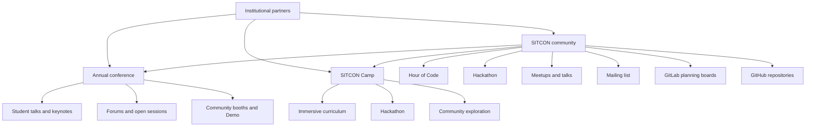
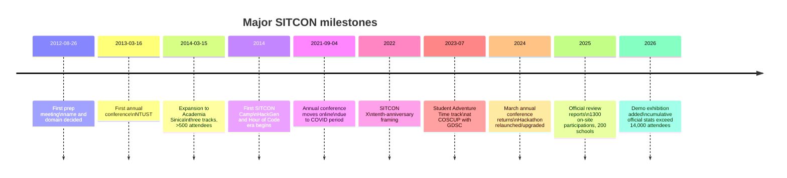

# SITCON and SITCON Camp

## Executive Summary

SITCON is a Taiwan-based, student-initiated, student-centered technology community whose full official name is **Students’ Information Technology Conference**. Official materials consistently describe it as a student-run community built to promote information-technology education, open-source values, and a stage where students can present, exchange ideas, and learn from one another. Public-facing materials also show that the organization treats **2012** as its founding/preparation year and **2013** as the year of the first annual conference, which is why both dates appear across its own sites. citeturn23view1turn37view0turn39search7turn9search8turn12view0

Analytically, SITCON is best understood not as a single annual conference but as a **community pipeline**. Its official 2026 Camp materials explicitly place the annual conference, SITCON Camp, Hour of Code, and Hackathon into one shared ecosystem: Hour of Code lowers the barrier to entry, Camp provides immersive practice, the annual conference gives students a public stage, and Hackathon turns ideas into collaborative prototypes. Meetups, mailing lists, GitLab planning boards, and GitHub repositories sustain the community between headline events. citeturn26view0turn17search8turn17search4turn16search0turn16search15

SITCON Camp is the summer, immersive branch of that ecosystem. In current public-facing form, it is a **five-day, four-night** camp aimed at **high-school students**, with a structure built around hands-on coursework, hackathon-style project work, and community activities. Earlier camp materials and retrospectives show a broader age range in the first years, but the public positioning has become more clearly “high-school on-ramp” over time. citeturn41search11turn26view0turn20search9turn12view0

The organization’s history shows stable values but flexible formats. Major turning points include the first conference in 2013, rapid scale-up and the launch of Camp/HackGen/Hour of Code in 2014, online conversion during the COVID period in 2021, the substitute “Student Adventure Time” track at COSCUP in 2023, the return to a March annual conference in 2024, the rebooted Hackathon in 2024, and the addition of a new Demo exhibition format in 2026. Publicly visible people show a similar pattern: a founding generation led by figures such as **Denny Huang** and **RSChiang**, followed by recurring younger leaders such as **Windless**, **康喔**, **Ak**, **Yoru**, and others. Full attendee rosters are not generally public; the names that are easy to verify are mostly organizers, speakers, and staff. citeturn12view0turn37view2turn37view1turn39search9turn40search7turn24view0turn15view0turn26view0

## Identity and Founding Story

Official brand guidance is unusually explicit: the organization’s English name is **Students’ Information Technology Conference**, the Chinese name is **SITCON 學生計算機年會**, and the preferred styling is **SITCON in all caps**, not “Sitcon.” This matters because SITCON is not just a label for one event; the official sites use it as the umbrella identity for a whole student community and its subprojects. citeturn39search7turn25search13turn26view0

The apparent “2012 or 2013?” ambiguity resolves cleanly once the sources are read together. Current official conference pages say SITCON “started” or was “launched” in **2012**, while older annual pages sometimes describe the active conference/community operation as being in place “since 2013.” The founder retrospective fills in the missing connective tissue: the first preparation meeting took place on **2012-08-26**, the name was chosen that day, the domain was purchased the same day, and the **first annual conference** then arrived after roughly half a year of preparation on **2013-03-16**. citeturn23view1turn8search3turn9search8turn12view0

The founding story is strongly tied to Taiwan’s open-source conference culture. A widely cited retrospective by co-founder Denny Huang says the spark came after the 2012 COSCUP season, when students asked why there was not a comparable conference where **students themselves** could be the main speakers and builders. The first organizing discussions spread quickly through Facebook and Plurk, and the first in-person preparation meeting brought together students from multiple schools and levels, from high school to graduate school. The resulting consensus was not just “another tech conference,” but a forum **run by students, with students as speakers, and students as the center of gravity**. citeturn11search2turn12view0turn37view2

The mission has stayed remarkably stable since then: student self-learning, open-source participation, knowledge exchange, and “learning by doing” through real public output. What has changed over time is the **delivery architecture** more than the ideology. citeturn23view1turn37view2turn39search5

The organizational logic illustrated by the official sites can be summarized like this. citeturn26view0turn17search8turn16search0turn16search15

## Historical Development

The first annual conference was held at **National Taiwan University of Science and Technology** on **2013-03-16**. In the founder retrospective, that first edition is recorded as having roughly **200 participants**. By **2014-03-15**, SITCON had moved to **Academia Sinica**, expanded to **three tracks**, and broken the **500-attendee** threshold according to the same retrospective and later official references. A 2015 iThome report shows that, by the third annual conference, SITCON was already visible enough to be covered nationally as an open-source and student-education story rather than merely a campus club event. citeturn12view0turn42search1turn11search1

What makes SITCON distinctive is that it broadened very early from “conference” into “ecosystem.” The founder retrospective records the first **HackGen** student hackathon in 2013, associated GitHub workshops to help students publish code, and “The Open Source Way” workshop later that year. It also records the first **SITCON Camp** appearing in 2014. Later official overview pages show this expansion hardening into a recognizable portfolio: annual conference, regular meetups, hackathons, workshops, Camp, and—by official 2026 materials—Hour of Code collaboration with Taiwan’s Ministry of Education starting in **2014**. citeturn12view0turn9search7turn39search5turn39search9

The COVID period did not erase SITCON, but it did bend its format. Official 2021 pages show the annual conference moved **online** and was free to attend; the venue page describes YouTube streaming plus a Gather-based virtual venue. Official Camp material for the same year similarly describes **SITCON Camp Online 2021**. In **2022**, the organization publicly framed the annual conference as **“SITCON X”**, its tenth anniversary. Then, in **2023**, the usual standalone annual conference format gave way to a cooperative fallback: the official site says that pandemic disruption had upset the normal spring schedule, so SITCON instead co-ran the **“Student Adventure Time”** track at **COSCUP 2023** with **Google Developer Student Clubs Taiwan & Hong Kong**, while announcing that the annual conference would return to **2024-03-09**. citeturn37view2turn6search4turn20search0turn37view0turn37view1

From **2024** onward, the public record suggests re-expansion rather than simple recovery. Official materials say the old 2014–2015 HackGen line was **upgraded into SITCON Hackathon** in 2024, the 2025 review reported **1,300 on-site participations**, **200 schools from Taiwan and abroad**, and a heavily student-heavy audience, and the 2026 annual site added a new **Demo exhibition** format next to talks and forums. The 2026 official overview also reports cumulative scale of more than **14,000 attendees**, **500+ student speakers**, **500+ meetups and lectures**, **10 camps**, and nearly **1,400 volunteers**. citeturn39search9turn40search7turn27view0turn24view0turn39search5

## Conference and Camp Formats

The annual conference and the camp serve different but complementary functions. The **annual conference** is SITCON’s public stage: in recent official form it is a one-day, ticketed-but-free event, normally in **March**, mixing student talks with invited keynotes and public-interest discussions. The **camp** is the immersion format: a multi-day cohort experience focused on structured learning, project practice, and socialization into the wider student/open-source community. citeturn24view0turn23view0turn26view0turn41search11

Official agenda pages for the annual conference show a format richer than a standard student conference. The 2026 agenda includes **keynotes**, regular **presentations**, **Espresso** short talks, **open sessions**, **collaborative sessions**, and **forums**. The venue map shows a mixture of sponsor booths, community booths, demo space, and social areas. The 2026 site also explicitly adds **Demo 展**, a project-exhibition format for interactive software, games, robots, and other student work. That combination suggests SITCON has evolved from “talks only” into a hybrid of conference, expo, and community fair. citeturn23view0turn14search2turn24view0turn23view2

The annual conference also uses access design to support inclusion. Official 2025 and 2026 materials repeat the principle that SITCON does **not charge attendees**, while still using ticket waves. The 2026 site further distinguishes **student tickets**, **general tickets**, **open-source contributor tickets**, and **long-distance tickets** for students from remote/overseas areas, showing that “free” is paired with targeted allocation and travel support rather than pure first-come-first-served openness. citeturn23view3turn24view0

SITCON Camp, by contrast, is explicitly framed as **“rooting downward”** into earlier-stage learners. Official 2026 Camp language calls it a five-day, four-night camp for **high-school students**, while earlier materials show that the first era was broader: 2016 registration documents accepted **junior-high and above**, and the founder retrospective recalled the first camp spanning **junior high through master’s students**. Across 2023–2026 camp pages, the recurring elements are immersive mainline curriculum, breadth classes, hackathon or project work, community exploration (“社群闖關”), and reflective/roundtable formats such as **視界咖啡館**. citeturn41search11turn26view0turn20search9turn12view0turn18view3turn18view2turn18view1

Camp also appears more narratively designed than the conference. The 2023–2025 camp sites build technical content around themed worlds—an “open-source universe,” ramen/open-source metaphors, and a “404 Not Found” coming-of-age frame—suggesting that the camp is not just a technical bootcamp but a social/identity-forming experience for younger students entering the ecosystem. Historically, camp has also used registration, selection, and fee-reduction policies, as shown by 2016 and 2017 subsidy documents, which differs from the annual conference’s stronger free-public-entry norm. citeturn18view3turn18view2turn18view1turn20search6turn20search7

## Open Infrastructure and Organizational Ecology

One of the most important background facts about SITCON is that its **openness is operational, not just rhetorical**. Official conference CFP pages repeatedly say that planning discussions happen on a **public mailing list** and that past preparation records can be browsed on **GitLab**. The public Google Group listings show that these are active coordination channels rather than decorative links. citeturn23view1turn23view3turn17search2turn17search16

The GitHub footprint reinforces the same point. The **sitcon-tw** GitHub organization publicly hosts SITCON web repositories, including annual-site code, the main site redirect repo, archived annual conference repos, a community guide, and operational tooling. Notably, the public **roboconf** repository describes itself as an internal tracking and conference-operation network used through SITCON’s administration process **since 2014**. Public repos also show camp-specific tooling such as the **camp2025-stock** system and newer experiments such as a **2026 MCP server** for session/speaker lookup. This is unusually transparent for a volunteer-run event organization, and it makes the open-source ethos visible in the organization’s own infrastructure. citeturn16search0turn16search3turn16search15turn16search5turn16search9turn28search3

The public record also shows SITCON becoming more institutionally connected without losing its student-led identity. In 2026, the annual conference site lists **Academia Sinica’s Institute of Information Science** and the **Open Culture Foundation** as co-organizers, with additional support from education-related programs. The 2026 Camp site lists **SITCON** and **OCF** as organizers, **National Yang Ming Chiao Tung University’s Department of Computer Science** as co-organizer, and **Google for Developers** as a special supporter. In other words, SITCON now sits in a hybrid zone: culturally student-led, but institutionally networked into Taiwan’s broader open-tech and education ecosystem. citeturn24view0turn26view0

## People and Public-Facing Network

The first preparation-meeting retrospective names a broad founding circle that included **Denny Huang, 莫風, 聽風, SCLi, RSChiang, ws育慈, Rifur, 獅子, Angel, 遠任, and Oscar**. That list matters because it shows SITCON was multi-school from the start rather than built around one department or one university. In the public materials reviewed for this report, however, the most traceable names over time are those who later appeared on official team pages, GitHub/website profiles, speaker pages, or interviews. Full attendee rosters for ordinary participants were not surfaced on the official sites I reviewed; the public record is richest for **organizers, staff, and speakers**. citeturn12view0turn15view0turn26view0turn23view0

The table below focuses on **publicly traceable core figures**. “Years active” means **years visible in the public sources reviewed**, so it should be read as conservative rather than exhaustive.

| Name | Role in SITCON | Years active in public record | Notable contributions | Public profile(s) |
|---|---|---|---|---|
| **Denny Huang** | Co-founder; chief coordinator of SITCON 2013 and 2014; recurring mentor/speaker | **2012–2026** | Public interviews and his GitHub profile describe him as a co-founder and chief coordinator of the first two annual conferences. The founder retrospective ties him to the 2012 launch cycle, and 2026 materials still place him in the conference opening and Camp teaching/mentoring orbit. citeturn11search2turn12view0turn28search0turn24view0turn13search8 | GitHub; personal page. citeturn28search0turn28search4 |
| **Poren Chiang RSChiang** | Co-founder; early operations lead; recurring community guide/moderator | **2012–2026** | Named in the first-meeting retrospective, shown on the 2014 official site as an administrative lead, publicly authors a SITCON community guide, and continues to appear in community-spirit talks and 2026 session moderation. citeturn12view0turn42search1turn42search8turn13search0turn13search5 | GitHub; Speaker Deck; COSCUP speaker bio. citeturn42search2turn42search10turn42search5 |
| **Takeshi** | Early conceptual catalyst; HackGen lead | **2012–2014** | The founder retrospective says a post-COSCUP idea from Takeshi helped spark the original “student conference” concept, and the 2014 HackGen site lists him as chief coordinator of the hackathon. citeturn12view0turn42search4 | Official HackGen staff page. citeturn42search4 |
| **Windless** | Recent recurring operations leader | **2024–2026** | A public HackMD profile and official pages show a rapid rise: SITCON 2025 admin lead, SITCON Camp 2025 admin lead, SITCON 2026 vice chief coordinator, and SITCON Camp 2026 chief coordinator. citeturn43search2turn15view0turn26view0 | Official team pages; HackMD bio. citeturn15view0turn26view0turn43search2 |
| **康喔 Kason Kang** | Recurring conference/camp operator; later tech entrepreneur/public profile owner | **2024–2026** | Official camp and conference pages show him as 2024 Camp chief coordinator, 2024 conference venue vice lead, 2025 Camp co-chief, 2026 conference vice chief, and 2026 Camp records lead. His personal site publicly identifies him as “康喔 / Kason Kang.” citeturn32view0turn39search8turn32view1turn15view0turn26view0turn43search0 | Personal site; official team pages. citeturn43search0turn15view0turn26view0 |
| **Ak Kuo Mutian** | Recurring program/course leader and public speaker | **2024–2026** | Official camp pages show him in 2024 Camp course-activity work and as 2026 Camp vice lead for course/activity planning; his GitHub profile says he is SITCON staff and a speaker active in Taiwan’s broader CS community. citeturn32view0turn26view0turn30search2 | GitHub; official Camp team pages. citeturn30search2turn32view0turn26view0 |
| **Yoru Kot** | Recurring development/course contributor | **2025–2026** | Official pages place Yoru in 2025 Camp course-activity work and 2026 Camp development leadership, while his own site says he joined SITCON as a volunteer contributing as a speaker, staff member, and Camp staff. citeturn32view1turn26view0turn43search7 | Personal site; official team pages. citeturn43search7turn32view1turn26view0 |
| **FKT** | Student-track/camp contributor and recurring speaker | **2023–2026** | The 2023 Student Adventure Time page lists FKT as a speaker; his 2025 speaker bio says he helped run the 2023 and 2024 COSCUP/SITCON/GDSC/OpenEDU student track and served in 2024 Camp content work; he also appears on the 2026 year team page. citeturn37view1turn34search8turn15view0 | Official speaker page; official team pages. citeturn34search8turn15view0 |

The public-facing speaker network is equally revealing. SITCON programs students, but it does **not** isolate them from the wider tech/public sphere. Official agenda pages show that 2020 featured keynotes by **李宏毅** and **CIH**; 2024 featured **Lin Chih-chen** of Taiwan Mobile/AppWorks and former Google Taiwan head **Chien-Li Feng**; 2025 featured **Yeh Bing-cheng** and **Birdman**; and 2026 paired student/community sessions with public figures and domain experts including **Vice President Hsiao Bi-khim**, **Li Hsueh-li** of *The Reporter*, **Apache committer Chia-Ping Tsai**, **Fox Hsiao** of iCook/INSIDE, **Taipei DoIT director Jack Chao**, **Cofacts co-founder Lee Piling**, and **NCCU professor Yeh Hao**. That mix supports the interpretation that SITCON is student-centered, but **deliberately intergenerational and cross-sector**. citeturn35search0turn34search1turn36search9turn24view0turn23view0

## Milestones and Analytical Takeaways

A compressed milestone view, cross-checked against founding notes, official annual/camp pages, and current overview pages, looks like this. citeturn12view0turn37view2turn37view0turn37view1turn39search9turn24view0

The broad analytical conclusion is that SITCON has been **structurally stable and format-flexible**. Its stable core is student agency, open-source culture, and creating a venue where students can publish themselves in public. Its flexible shell is the way it expresses that mission: conference, camp, meetup, workshop, online event, COSCUP track, hackathon, demo hall, podcast, GitHub repos, GitLab boards, and public mailing-list discussion. In other words, SITCON’s real “background story” is not one event becoming bigger; it is a student conference becoming a **durable civic-technical learning infrastructure** for Taiwanese students and adjacent open-tech communities. citeturn23view1turn26view0turn39search5turn16search15turn17search8

A final caveat is important for accuracy: the public record is rich on **who organized** and **who spoke**, but comparatively thin on ordinary attendee identities. Where participant lists are unavailable, the safest conclusion is simply “unspecified in public sources reviewed.” That limitation does **not** weaken the main picture, because the official sources are already strong enough to establish SITCON’s history, mission, formats, milestone trajectory, and recurrent public-facing leaders. citeturn15view0turn26view0turn23view0